# Eureka ACU — User Manual

## Interface Overview

The ACU dashboard is accessible via web browser at the unit's management IP address. The interface is organized into a persistent header, a left sidebar for navigation, and a main content area.

### Header Status Bar

The status bar is permanently visible at the top of every page. It shows unit identity and real-time system state at a glance.

**Left side:** Unit name and model label. The small LED to the left of the name reflects LAN state (green = up, red = down, gray = unknown).

**Badges (left to right):**

| Badge | States | Meaning |
|---|---|---|
| **LAN** | Green = up · Red = down | Management network interface |
| **Transmit** | Green = on · Red = off | Uplink transmitter active |
| **Lock** | Green = locked · Red = unlocked | Modem demodulator carrier lock |
| **Tracking** / **Auto Pointing** / **Manual Pointing** / **Searching** / **Ready** / **CALIBRATING…** / **Fault** / **Idle** | Green / Yellow / Blue / Yellow / Blue / Yellow / Red / Gray | Current supervisor mode. Green = actively tracking. Yellow = working toward lock. Blue = ready or operator-controlled. Red = fault requires attention. |
| **GPS** / **Manual GPS** | Green = GPS fix · Blue = manual coordinates | Active location source. **Manual GPS** means the site coordinates are set manually in Configuration → Location. |
| **Signal** _dBm_ | Green = good · Yellow = low · Red = bad | RF signal level received from the modem, in dBm |
| **COMPASS** / **COMPASS: POOR** / **NO CAL** | Green / Yellow / Red | Magnetometer calibration quality. Poor or uncalibrated compass reduces pointing accuracy — recalibrate if yellow or red. |

When the supervisor state is **Tracking** or **Auto Pointing**, a red **Stop Pointing** button appears to the right of the COMPASS badge. Clicking it sends an immediate stop command to the ACU daemon and returns the supervisor to Idle.

### Navigation Sidebar

- **Overview** — Real-time system dashboard
- **Stats** — Sensor history charts
- **Configuration** — System, network, ESA, location, satellite, and advanced parameters
- **Tools** — Logs, events, calibration, firmware upgrade, and reboot

---

## Overview

The Overview page is the main operational dashboard. It consolidates all real-time telemetry into a single view.

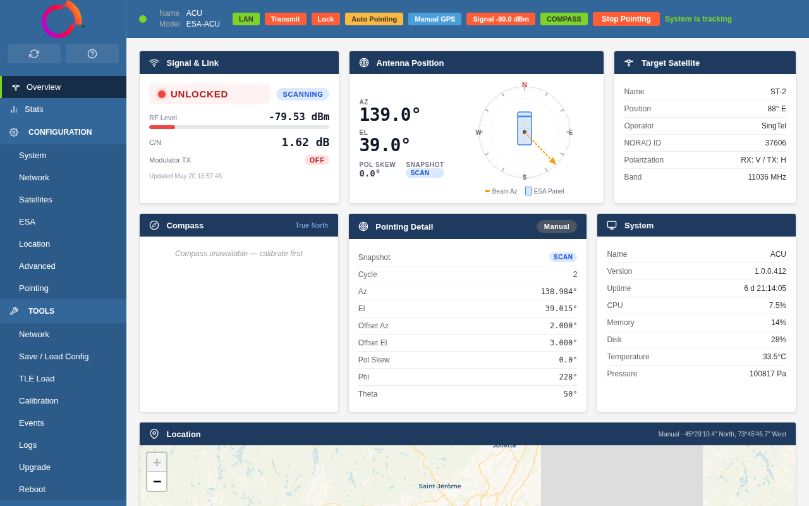

### System Info

| Field | Description |
|---|---|
| Name | Configured identifier for this ACU unit |
| Uptime | Time since last system start |
| Current time | System clock (used for satellite position calculations) |
| Version | Installed firmware version |
| Memory usage | RAM utilization percentage |
| CPU usage | Processor load percentage |
| Disk usage | Storage utilization percentage |

### Target Satellite

Displays the currently active satellite being tracked.

| Field | Description |
|---|---|
| Name | Satellite identifier (e.g. ST-2) |
| Position | Orbital slot in degrees East/West |
| Operator | Satellite fleet operator |
| NORAD ID | Catalog number used for TLE orbital data lookup |
| Polarization | RX and TX polarization (V = vertical, H = horizontal) |
| Band | Downlink frequency in MHz |

### Modem

Real-time status received from the satellite modem via the AMIP protocol.

| Field | Description |
|---|---|
| Demod Lock | **LOCKED** (green) = modem has acquired the downlink carrier |
| RF Level | Received signal power in dBm |
| C/N | Carrier-to-noise ratio in dB |
| Modulator | **ON** (green) = uplink transmitter is active |
| Updated | Timestamp of the last modem telemetry update |

### Elevation and Azimuth

Visual gauges show the current beam pointing angles:

- **Elevation** — Angle above the horizon (0° = horizon, 90° = zenith). Displayed numerically in degrees (e.g. 38.2°).
- **Azimuth** — Horizontal pointing direction measured clockwise from North (e.g. 139.1°).

### Compass

Displays the heading measured by the onboard magnetometer, expressed in degrees and cardinal direction (e.g. 230° SW). The magnetic field strength is shown in microtesla (µT).

### Sensors

| Field | Description |
|---|---|
| Temperature | Internal board temperature in °C |
| Pressure | Barometric pressure in Pa |
| Updated | Timestamp of the last sensor reading |

### Pointing

Detailed state of the active pointing algorithm:

| Field | Description |
|---|---|
| Snapshot | Current algorithm phase: **SCAN** (searching), **PEAK** (optimizing), **BASE** (holding) |
| El. | Current elevation beam angle |
| Az. | Current azimuth beam angle |
| Offset El. / Offset Az. | Accumulated offset from the TLE-predicted base position |
| Pol. Skew | Polarization skew correction in degrees |
| Cycle | Number of completed pointing cycles |
| Theta / Phi | Beam angles in the antenna's local coordinate frame |

### Pointing Readiness

AUTO pointing only starts when **all six** readiness criteria are met (`all_readiness_ok()` in the supervisor). The Antenna Position card shows them as six dots — **green = met, red = not met** — and hovering a dot gives the exact reason:

| Dot | Criterion | Common reason when red |
|---|---|---|
| **Cal** | Valid compass calibration loaded | No/invalid calibration, or field far from WMM (hover shows field µT, coverage %) |
| **Sen** | Fresh IMU data | Magnetometer / accelerometer not reporting |
| **Tle** | Active TLE loaded and satellite visible | No active TLE, or satellite below the horizon |
| **Loc** | Position available | No GPS fix and no manual override |
| **Esa** | ESA TX **and** RX connected and initialized | ESA link down / FSM not yet at SET BEAM |
| **Modem** | Modem connected | No connection from the configured `modemIp` |

If pointing stays in **IDLE**, a red dot tells you exactly which subsystem is blocking it — no log-diving required. These flags are owned by the acumon supervisor (single source of truth) and exposed live via `/api/readiness`.

### GPS Position

Displays the unit's geographic position on a map when a GPS fix is available. If no GPS receiver is connected or the unit is configured for Manual location mode, this panel shows "No GPS data available."

---

## Manual Pointing

Manual Pointing mode lets the operator take direct control of the antenna beam, bypassing the automatic satellite acquisition algorithm. It is intended for alignment verification, diagnostic pointing, and field commissioning.

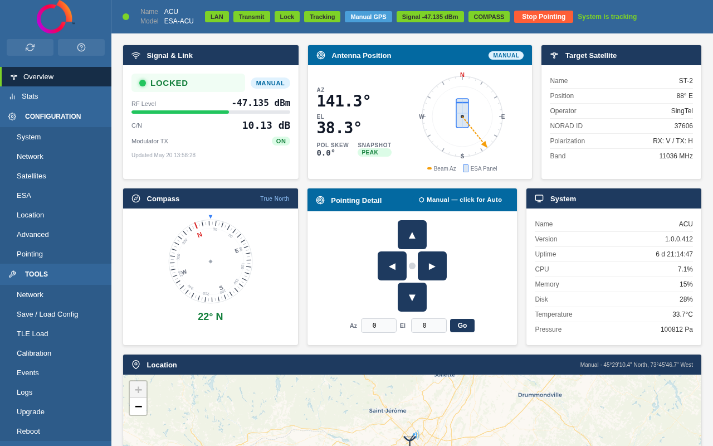

### Entering and Exiting Manual Pointing

The **Pointing Detail** card in the Overview page has a toggle button in its header:

| State | Button label | Action |
|---|---|---|
| Auto Pointing / Tracking / Ready | **Manual** | Enter Manual Pointing mode |
| Manual Pointing | **⬡ Manual — click for Auto** | Exit Manual Pointing and return to Idle |

When Manual Pointing is active:
- The **Pointing Detail** and **Antenna Position** card headers turn blue.
- The header status bar shows **Manual Pointing** (blue badge).
- The automatic scan/track algorithm is suspended.
- The **Compass** card continues updating — the magnetometer runs independently of the pointing mode.

### Nudge Controls

Four arrow buttons shift the beam by **0.5°** per click in the corresponding direction:

| Button | Effect |
|---|---|
| ▲ | Increase elevation (+0.5°) |
| ▼ | Decrease elevation (−0.5°) |
| ◄ | Decrease azimuth (−0.5°) |
| ► | Increase azimuth (+0.5°) |

Clicks are additive — each press accumulates on top of the previous position.

### Direct Az/El Input

Below the arrow buttons, two numeric fields allow entering an absolute azimuth and elevation:

1. Type the desired **Az** value (degrees, e.g. `140.5`).
2. Type the desired **El** value (degrees, e.g. `36.0`).
3. Click **Go** or press **Enter** in either field.

The beam jumps immediately to the specified position, regardless of the current offset.

> **Note:** In Manual Pointing mode, azimuth and elevation are referenced to the antenna's local frame with the base position zeroed. Az 0° / El 0° is the mechanical center. The values shown in the Antenna Position card reflect the current beam position.

### Returning to Auto Pointing

Click the **⬡ Manual — click for Auto** button in the Pointing Detail card header. The system returns to Idle and will resume automatic acquisition on the next pointing cycle.

> **Warning:** Exiting Manual Pointing does not automatically restart tracking. The ACU returns to Idle and will begin a new scan cycle from the TLE-predicted position.

---

## Statistics

The Statistics page provides time-series charts of onboard sensor data.

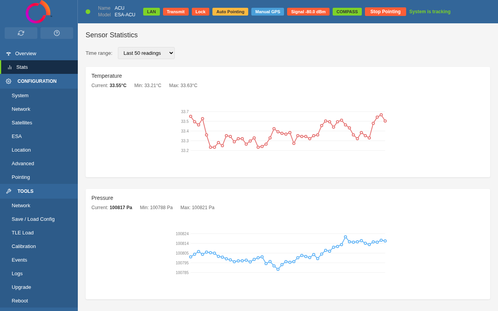

Use the **Time range** selector at the top to choose the number of readings to display (e.g. Last 50 readings, Last 200 readings).

### Temperature

Line chart of internal board temperature (°C). The panel header shows the current value along with the minimum and maximum recorded in the selected window.

### Pressure

Line chart of barometric pressure (Pa). Useful for detecting environmental changes or verifying sensor health. Min/max values are shown alongside the current reading.

---

## Satellites

The Satellites page lists all configured satellite profiles and identifies which one is currently active.

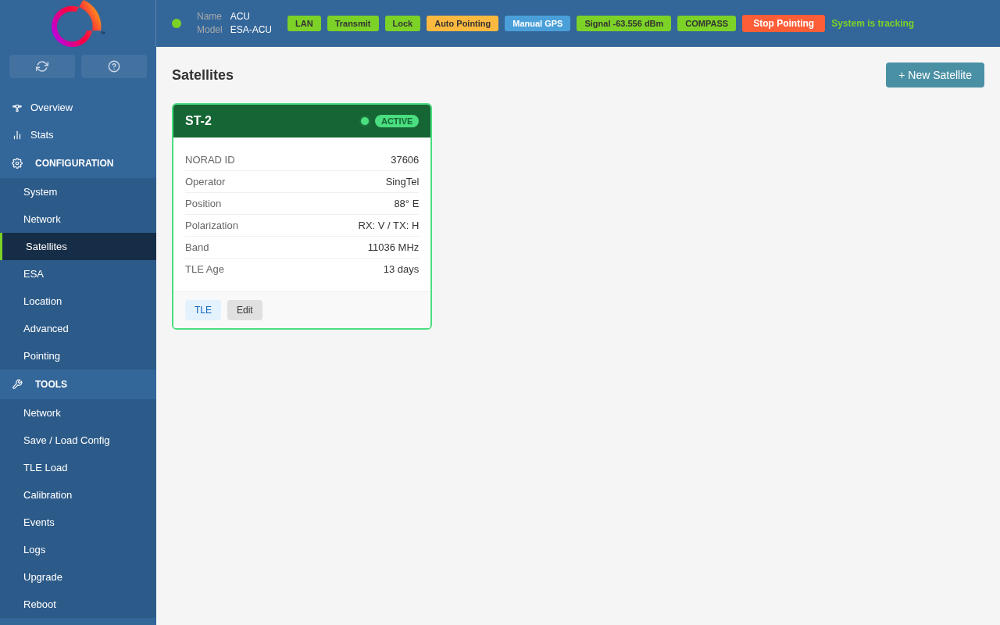

Each satellite card displays:

| Field | Description |
|---|---|
| Name | User-assigned satellite identifier |
| Status badge | **ACTIVE** (green) = currently selected for pointing |
| NORAD ID | Catalog number for TLE data retrieval |
| Operator | Satellite fleet operator |
| Position | Orbital longitude in degrees East |
| Polarization | RX and TX polarization settings |
| Band | Downlink frequency in MHz |
| TLE Age | Number of days since the TLE orbital data was last updated. TLE data older than 14 days may reduce pointing accuracy. |

### Actions

- **TLE** — View or update the Two-Line Element orbital data for this satellite
- **Edit** — Modify the satellite profile parameters
- **+ New Satellite** — Add a new satellite profile

---

## Configuration — System

System Configuration contains the core identity and modem connection parameters for the ACU.

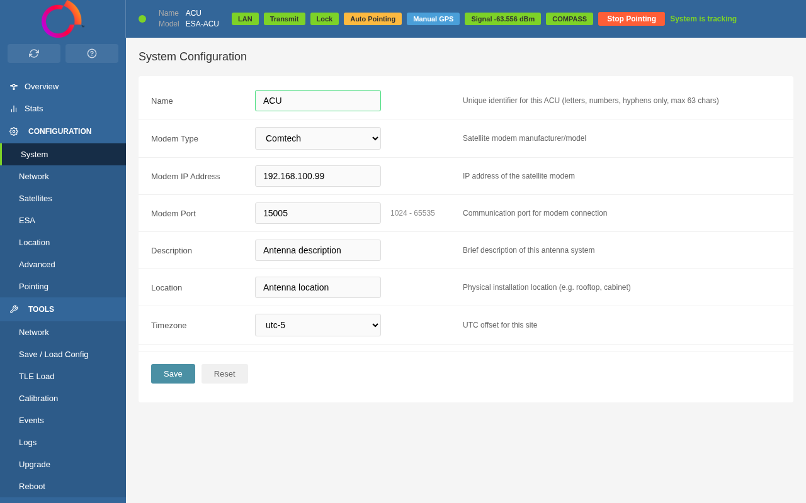

| Field | Constraints | Description |
|---|---|---|
| Name | Letters, numbers, hyphens; max 63 chars | Unique identifier for this ACU unit, shown in the header |
| Modem Type | Dropdown | Satellite modem manufacturer/model (e.g. Comtech) |
| Modem IP Address | — | IP address of the satellite modem on the network |
| Modem Port | 1024 – 65535 | TCP/UDP port used for AMIP communication with the modem |
| Description | — | Free-text description of the antenna installation |
| Location | — | Physical installation site (e.g. rooftop, equipment cabinet) |
| Timezone | Dropdown | UTC offset for the installation site |

Click **Save** to apply changes. Click **Reset** to revert to the last saved values without reloading the page.

> **Note:** After changing the Modem IP Address or Modem Port, the ACU daemon restarts the AMIP listener. Ensure the modem's AMIP settings match before saving.

---

## Configuration — Network

Network Configuration controls the ACU's IP connectivity.

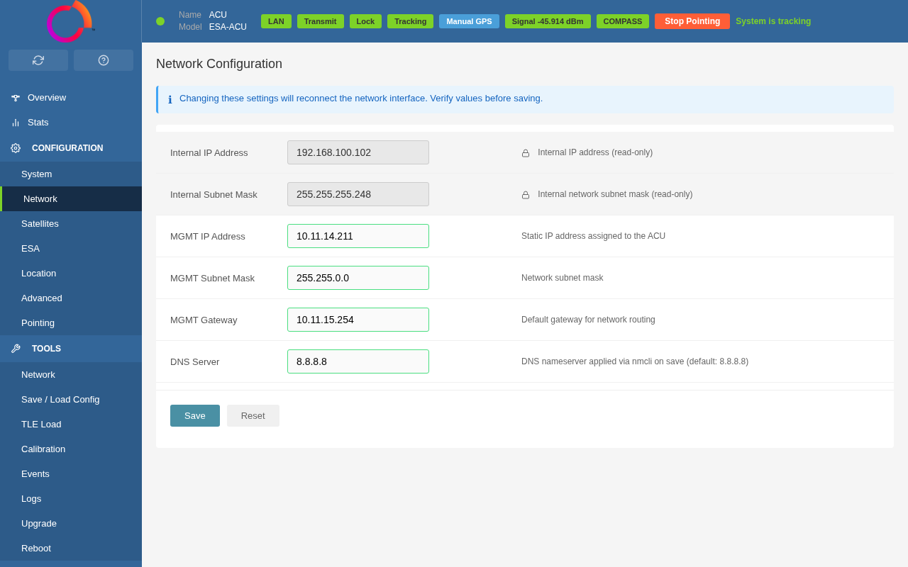

| Field | Description |
|---|---|
| Internal IP Address | _(read-only)_ Fixed internal interface address used for ESA communication |
| Internal Subnet Mask | _(read-only)_ Subnet mask for the internal interface |
| MGMT IP Address | Static IP address for the management network interface |
| MGMT Subnet Mask | Subnet mask for the management network |
| MGMT Gateway | Default gateway for management traffic |

Read-only fields are indicated by a lock icon and cannot be edited from the dashboard.

Click **Save** to apply. A network configuration change takes effect after the next system restart.

> **Warning:** Entering an incorrect MGMT IP Address or Gateway will cause loss of dashboard access. Ensure network values are correct before saving.

---

## Configuration — ESA

ESA Configuration defines the network endpoints for the TMYTEK Electronically Steerable Antenna panels.

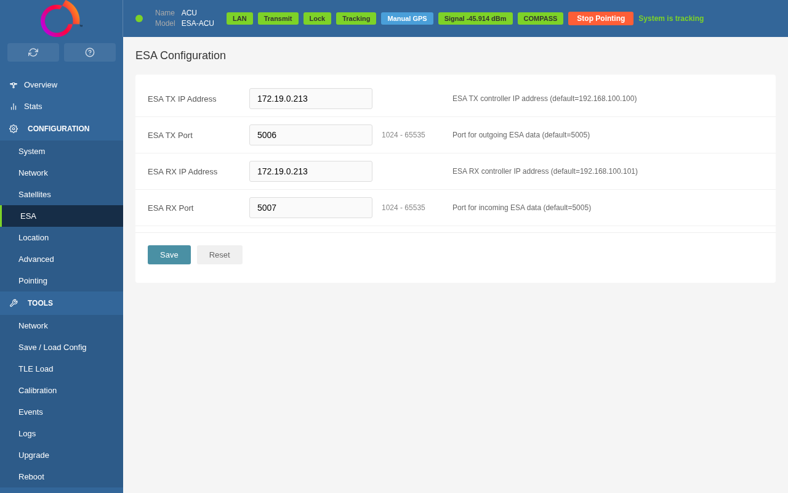

| Field | Constraints | Description |
|---|---|---|
| ESA TX IP Address | — | IP address of the TX (transmit) ESA panel controller |
| ESA TX Port | 1024 – 65535 | UDP port for outgoing beam commands to the TX panel (default: 5005) |
| ESA RX IP Address | — | IP address of the RX (receive) ESA panel controller |
| ESA RX Port | 1024 – 65535 | UDP port for incoming data from the RX panel (default: 5005) |

The TX and RX panels may share the same IP address if hosted on the same controller, but should use different ports.

Click **Save** to apply. The ACU daemon reconnects to both ESA panels immediately after saving.

---

## Configuration — Location

Location Configuration sets the geographic position of the installation site. This is used together with TLE orbital data to calculate the predicted satellite azimuth and elevation.

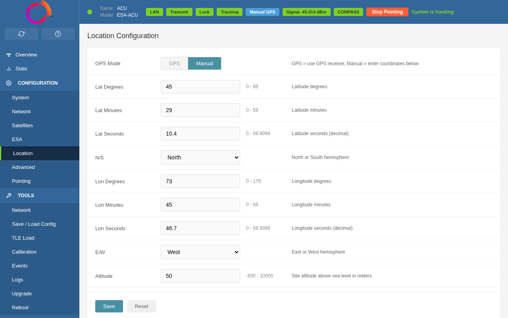

### GPS Mode

| Mode | Description |
|---|---|
| **GPS** | Position is read automatically from the onboard u-blox GPS receiver |
| **Manual** | Position is entered manually using the fields below |

When **Manual** mode is selected, the coordinate fields become active.

### Coordinate Fields

Coordinates are entered in degrees-minutes-seconds (DMS) format:

| Field | Range | Description |
|---|---|---|
| Lat Degrees | 0 – 89 | Latitude degrees |
| Lat Minutes | 0 – 59 | Latitude minutes |
| Lat Seconds | 0 – 59.9999 | Latitude seconds (decimal) |
| N/S | North / South | Hemisphere selector |
| Lon Degrees | 0 – 179 | Longitude degrees |
| Lon Minutes | 0 – 59 | Longitude minutes |
| Lon Seconds | 0 – 59.9999 | Longitude seconds (decimal) |
| E/W | East / West | Hemisphere selector |
| Altitude | -500 – 10000 | Site altitude above sea level in meters |

> **Note:** Accurate location data is critical for correct satellite acquisition. A position error of 1° corresponds to an angular pointing error that may prevent initial lock.

---

## Configuration — Advanced

The Advanced page exposes low-level sensor hardware parameters. These values are set at the factory and should only be modified if instructed by technical support.

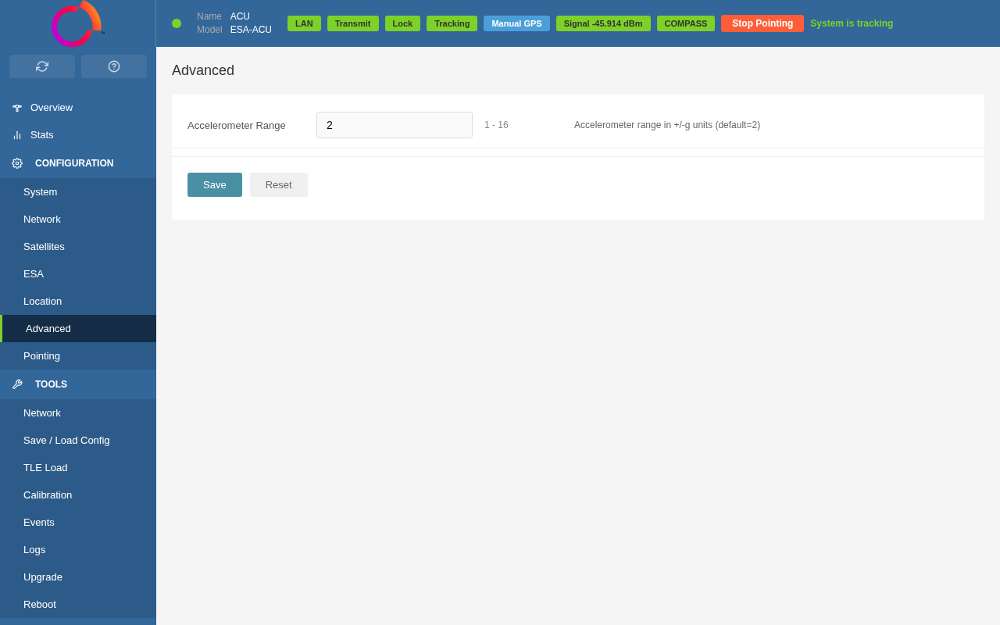

| Field | Range | Description |
|---|---|---|
| Accelerometer Range | 1 – 16 | Full-scale range of the ICM-20948 accelerometer in ±g units. Default is 2. Higher values reduce sensitivity but increase the measurable range of motion. |

Click **Save** to apply. Click **Reset** to revert to the last saved value.

---

## Configuration — Satellite Profiles

The Satellite Profiles page lists all configured satellites and allows adding, editing, activating, and deleting profiles. It is accessible from the Configuration section of the sidebar.

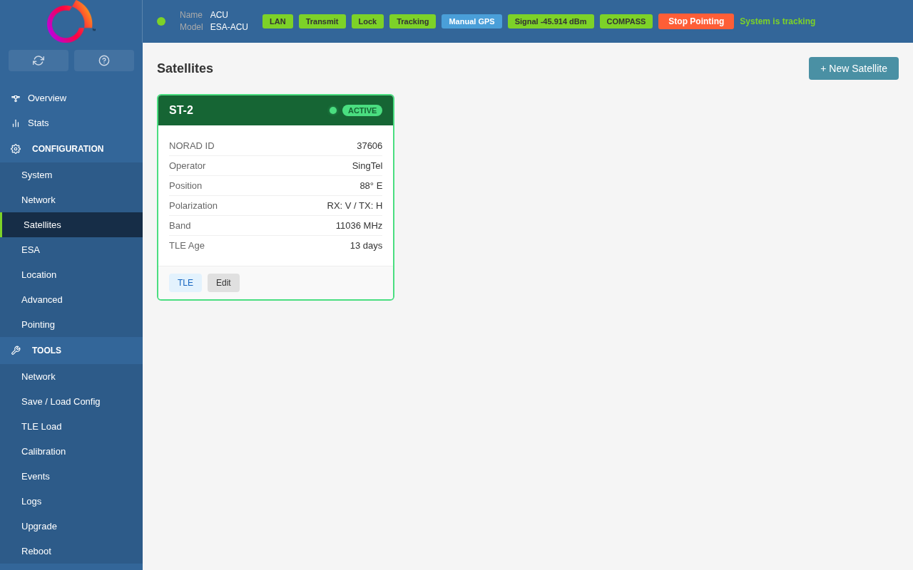

Each satellite card displays:

| Field | Description |
|---|---|
| Name | User-assigned satellite identifier |
| Status badge | **ACTIVE** (green) = currently selected for pointing |
| NORAD ID | Catalog number for TLE data retrieval |
| Operator | Satellite fleet operator |
| Position | Orbital longitude in degrees East or West |
| Polarization | RX and TX polarization settings (V = vertical, H = horizontal) |
| Band | Downlink frequency in MHz |
| TLE | TLE data age in days, or **Not available** if no TLE has been loaded |

### Actions

| Button | Available on | Action |
|---|---|---|
| **Activate** | Inactive satellites | Set this satellite as the active pointing target |
| **TLE** | All satellites | View or update the Two-Line Element orbital data |
| **Edit** | All satellites | Modify the satellite profile parameters |
| **Delete** | Inactive satellites | Remove the satellite profile permanently |

The **+ New Satellite** button (top-right) opens the satellite creation form.

> **Note:** Only the active satellite can be pointed to. Switching the active satellite during a tracking session will stop tracking — the system returns to the Ready state and must be commanded to start pointing again.

---

## Tools — Logs

The Logs page provides direct access to the ACU system message log (`acu_msg.log`).

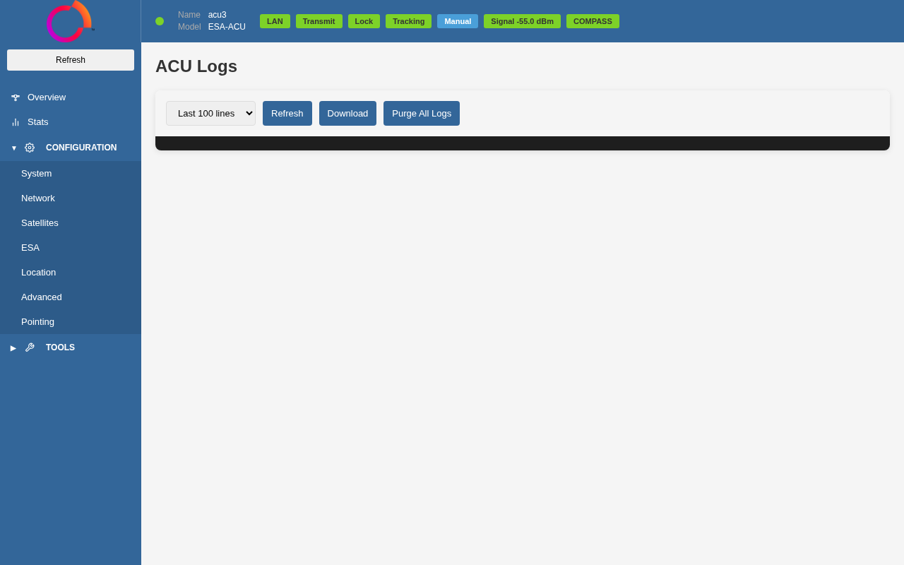

Use the **Time range** selector to limit the number of lines displayed (e.g. Last 100 lines, Last 500 lines).

| Button | Action |
|---|---|
| **Refresh** | Reload the log view with the latest entries |
| **Download** | Download the full log file to your computer |
| **Purge All Logs** | Permanently delete all log files on the unit. Use with caution. |

Log entries are displayed in a dark terminal-style panel, with the most recent entries at the bottom.

---

## Tools — Events

The Events page provides a structured audit trail of significant system actions.

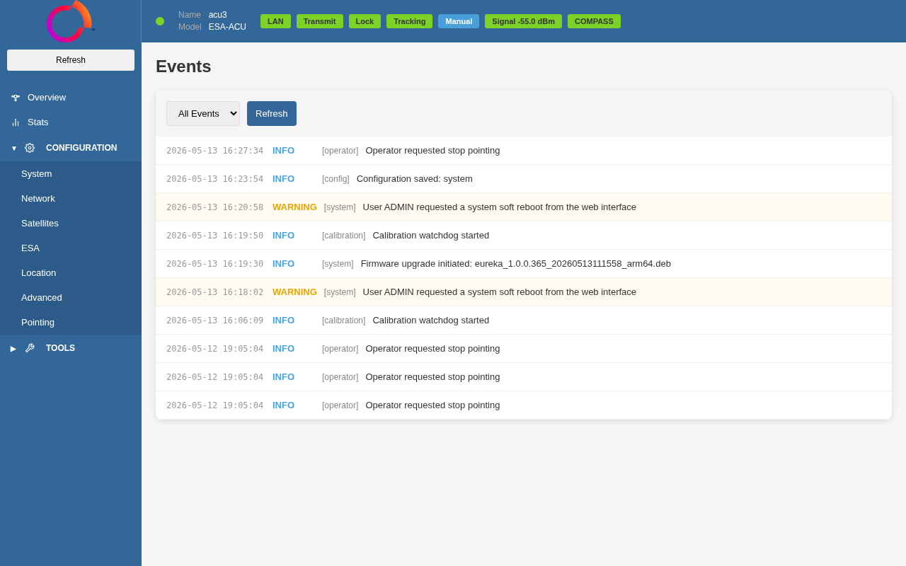

Use the **All Events** filter dropdown to narrow the view by event category (operator, config, system, calibration). Click **Refresh** to load the latest entries.

### Event Levels

| Level | Color | Meaning |
|---|---|---|
| INFO | Blue | Normal operational event |
| WARNING | Yellow | Action that may require attention |
| ERROR | Red | Failure requiring investigation |

### Event Sources

| Source | Description |
|---|---|
| `[operator]` | Action initiated from the dashboard (e.g. stop pointing) |
| `[config]` | Configuration change saved |
| `[system]` | System-level event (reboot, firmware upgrade) |
| `[calibration]` | Sensor calibration activity |

---

## Tools — Calibration

The Calibration page allows manual recalibration of the onboard inertial sensors. Calibration is required after initial installation and after any physical relocation of the unit.

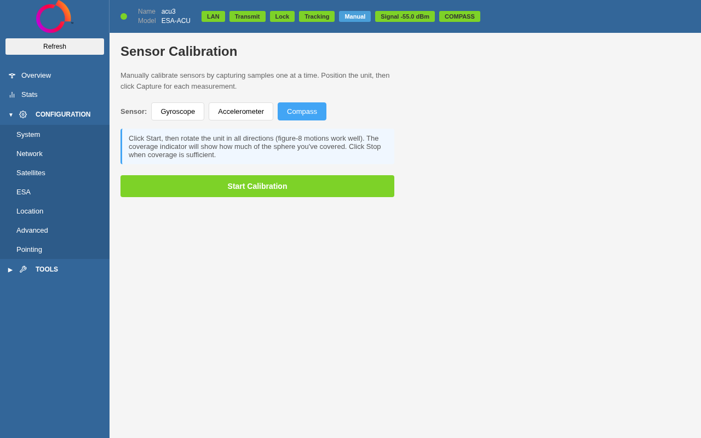

Three sensors can be calibrated independently:

| Sensor | Purpose |
|---|---|
| **Gyroscope** | Measures angular rotation rate for attitude stabilization |
| **Accelerometer** | Measures tilt and linear acceleration |
| **Compass** | Measures magnetic heading for absolute north reference |

### Compass Calibration Procedure

1. Select the **Compass** tab.
2. Click **Start Calibration**.
3. Rotate the unit through all orientations — figure-8 motions cover the sphere efficiently.
4. The coverage indicator shows sphere coverage in real time.
5. Click **Stop** when coverage is sufficient.

The compass calibration result (good / poor / not calibrated) is reflected in the **COMPASS** badge in the header. A **poor** or **not calibrated** compass will degrade pointing accuracy.

> **Note:** Perform compass calibration away from large metal structures, motors, or other sources of magnetic interference.

### Reading Calibration Results

After a compass calibration the result is stored in `sensors_cal.json` and summarized in the **Calibration History** view and the **Cal** readiness dot (hover for details). The numbers that matter:

| Value | What it means | Healthy range |
|---|---|---|
| **Field strength** | Magnitude of the local geomagnetic field after hard/soft-iron correction (the fitted sphere radius) | Site-dependent, ~25–65 µT — should match the WMM value for your location (e.g. Montreal ≈ 53 µT) |
| **Coverage** | Fraction of the 320-sector sphere that the rotation touched | ≥ 80 % for a well-constrained fit |
| **Fit error** | RMS residual of the samples against the fitted ellipsoid | < 5 % (very low is good — but only meaningful when coverage is high) |
| **Hard-iron** | Constant magnetic offset from the unit's own ferrous parts (µT) | Intrinsic to the unit; large is normal |

A calibration whose **field strength is far from the WMM expectation** for the site is suspect, even if the fit error looks excellent — see below.

### Sample Filtering — the Magnitude Gate

During the fit, raw magnetometer samples are gated: any sample whose **uncorrected** magnitude falls outside **[22, 67] µT** is discarded before the ellipsoid is solved (AN4246 physical-validity bound). This filter matters because it can silently shrink a calibration:

- On a unit with a **large hard-iron offset**, the *uncorrected* magnitude swings widely as the unit rotates, so many otherwise-good samples fall outside [22, 67] and are dropped — **even though the operator covered the sphere correctly.**
- The **live** coverage indicator counts the raw rotation (it can read e.g. 87 %), but the **saved** coverage is computed on the *surviving* samples (and can drop to e.g. 50 %). A gap between the two is the signature of heavy filtering.
- Discarding the magnitude extremes can also **bias the fitted field strength low** — which is why a field well below the WMM value is a red flag.

If a calibration looks poor despite good operator technique, check the **rejected-sample count** and the **live-vs-saved coverage gap** in the Calibration History entry — that is usually the magnitude gate, not the operator.

### The Math — AN4246 10-Parameter Ellipsoid Fit

The compass fit implements Freescale **AN4246** (sections 4–5), the 10-element eigen-decomposition method, mirrored in `calibration_math.py` / `magcalc.c`:

1. Build the 10×10 measurement matrix (quadratic + linear terms of the centered samples).
2. Eigen-decompose; the eigenvector of the smallest eigenvalue is the ellipsoid solution.
3. Extract the **hard-iron** vector **V** and the ellipsoid matrix **A**.
4. Normalize **A** to unit determinant and compute **B**, the geomagnetic field magnitude.
5. **W⁻¹ = A^(1/2)** (soft-iron inverse) via eigen-decomposition of **A** (AN4246 Eq. 20).
6. Validate **B ∈ [22, 67] µT** and report the fit-error percentage.

At runtime each magnetometer reading **m** is corrected as **m_cal = W⁻¹·(m − V)** before the tilt-compensated heading is computed.

---

## Tools — Firmware Upgrade

The Firmware Upgrade page allows uploading a new firmware package to the ACU.

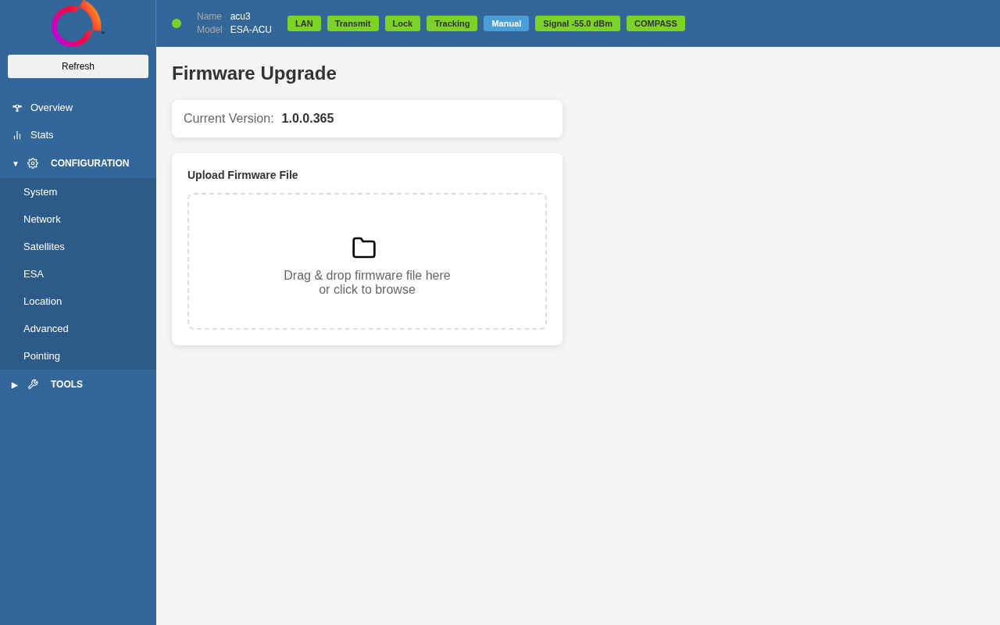

The **Current Version** is displayed at the top of the page (e.g. 1.0.0.365).

### Upgrade Procedure

1. Obtain the firmware `.deb` package for the target version.
2. Drag and drop the file onto the upload area, or click the area to open a file browser.
3. The upload will begin automatically. Progress is shown in the upload area.
4. Once the upload completes, the system initiates the upgrade and restarts automatically.

The upgrade process is logged in the Events page under `[system]` — Firmware upgrade initiated.

> **Warning:** Do not power off the unit during a firmware upgrade. An interrupted upgrade may require factory recovery.

---

## Tools — System Reboot

The System Reboot page provides controlled restart options for the ACU.

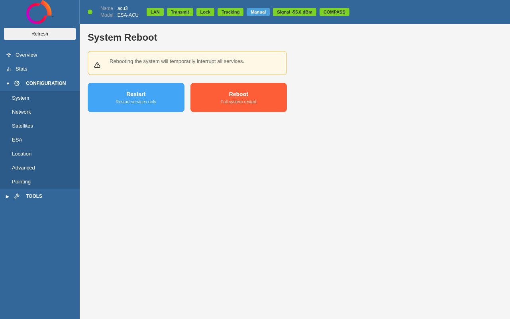

> **Note:** Rebooting the system will temporarily interrupt all services, including active satellite tracking.

| Button | Action |
|---|---|
| **Restart** | Restarts the ACU software services only (acumon daemon + dashboard). The operating system remains running. Faster recovery — typically 10–15 seconds. |
| **Reboot** | Full hardware restart of the Raspberry Pi. Required after network configuration changes or firmware upgrades. Recovery takes approximately 60 seconds. |

A soft restart is sufficient for most operational scenarios (e.g. applying a configuration change or recovering from a software fault). Use full reboot only when instructed or after a firmware upgrade.

---

## Tools — Save / Load Configuration

The Save / Load Configuration page manages the ACU configuration files — `config.ini` (system settings) and `satellites.ini` (satellite profiles). It provides download, upload, backup history, and factory reset in one place.

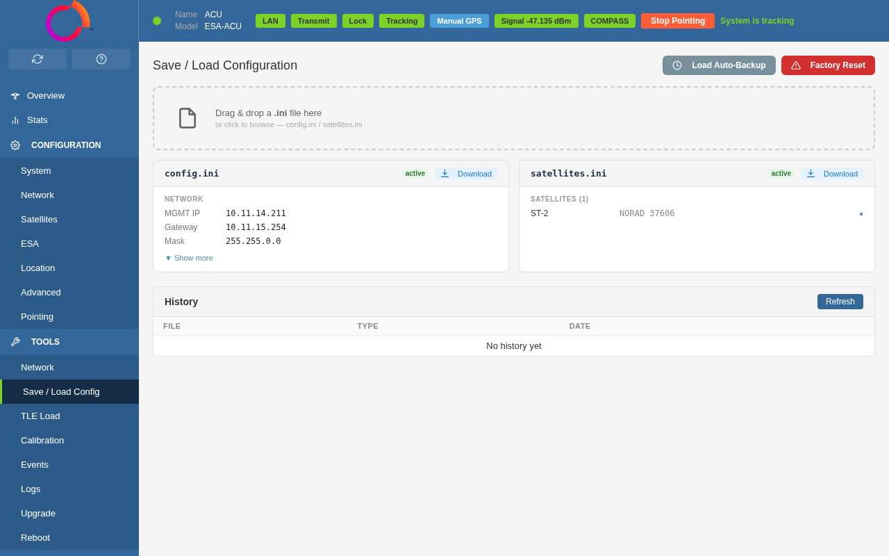

### Active Configuration

Two panels display the currently running configuration files:

| Panel | File | Contents |
|---|---|---|
| **config.ini** | System configuration | Network settings, modem parameters, ESA endpoints, location, pointing settings |
| **satellites.ini** | Satellite profiles | All configured satellites with NORAD IDs, orbital parameters, and frequency data |

Each panel shows a summary of the key fields. Click **▼ Ver más** to expand the full field list. The **Download** button saves the file to your computer.

### Upload / Replace Configuration

Drag and drop a `.ini` file onto the upload area at the top of the page, or click to browse. The system automatically detects whether the file is a `config.ini` or `satellites.ini` based on its contents.

After upload, a pending panel appears below the active config with a diff of the changes. Click **Apply** to activate the new configuration (acumon hot-reloads without a full restart), or **Discard** to cancel.

### Backup History

The History table lists all previously uploaded configuration files with timestamps. Any backup can be re-downloaded or deleted.

| Column | Description |
|---|---|
| File | Filename with timestamp prefix (e.g. `20260519_132125_config.ini`) |
| Type | `backup` — created automatically before each upload |
| Date | Timestamp when the backup was created |

Use the **Refresh** button to reload the history list. Click **Download** next to any entry to retrieve that version, or **Delete** to remove it permanently.

### Factory Reset

The **Factory Reset** button (top-right corner) restores `config.ini` to the factory-default values. A confirmation dialog is shown before the reset is applied.

> **Warning:** Factory Reset overwrites all operator-configured settings (IP addresses, modem parameters, ESA endpoints, etc.). Download a backup of the current `config.ini` before proceeding.

### Load Auto-Backup

The **Load Auto-Backup** button restores the most recent automatic backup. Use this to quickly undo the last configuration change if the system became unreachable after saving.

---

## Tools — TLE Management

The TLE Management page allows uploading and inspecting Two-Line Element (TLE) orbital data used to calculate satellite azimuth and elevation predictions.

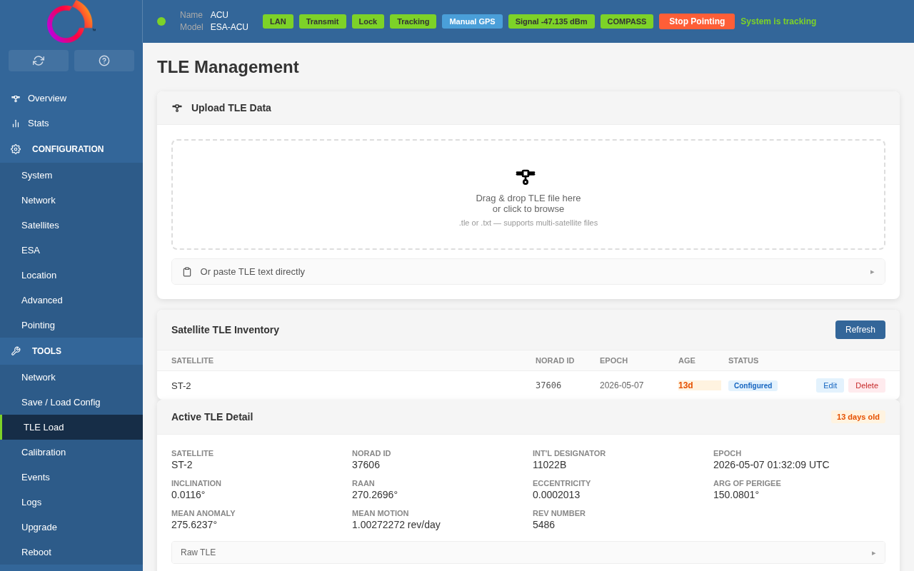

### Upload TLE Data

Drag and drop a `.tle` or `.txt` file onto the upload area, or click to browse. Multi-satellite TLE files (standard three-line or two-line format files containing multiple entries) are supported — the system parses all entries and matches them to configured satellites by NORAD ID.

Alternatively, expand **Or paste TLE text directly** to paste raw TLE lines into the text field.

### Satellite TLE Inventory

A table lists all satellites that have TLE data on the unit:

| Column | Description |
|---|---|
| Satellite | Satellite name as configured in the profile |
| NORAD ID | Catalog number |
| Epoch | Date of the TLE data set |
| Age | Number of days since the epoch, color-coded (normal = white, elevated = amber, stale = red) |
| Status | **Active** = this satellite is currently selected for pointing |
| Edit | Opens the raw TLE editor for manual correction |

Click **Refresh** to reload the inventory after an upload.

### Active TLE Detail

The lower panel expands the full orbital element set for the active satellite's TLE, including inclination, RAAN, eccentricity, argument of perigee, mean anomaly, mean motion, and revolution number. Expand **Raw TLE** to view the original two-line text.

> **Note:** TLE data older than 14 days may produce degraded pointing predictions. Upload fresh TLE data regularly, especially for satellites in non-geostationary orbits. An orange warning banner on the Overview page indicates that the active satellite's TLE is missing or has exceeded the configured age threshold.

---

## Tools — Network Stats

The Network Stats page displays real-time interface counters for the ACU's Ethernet port.

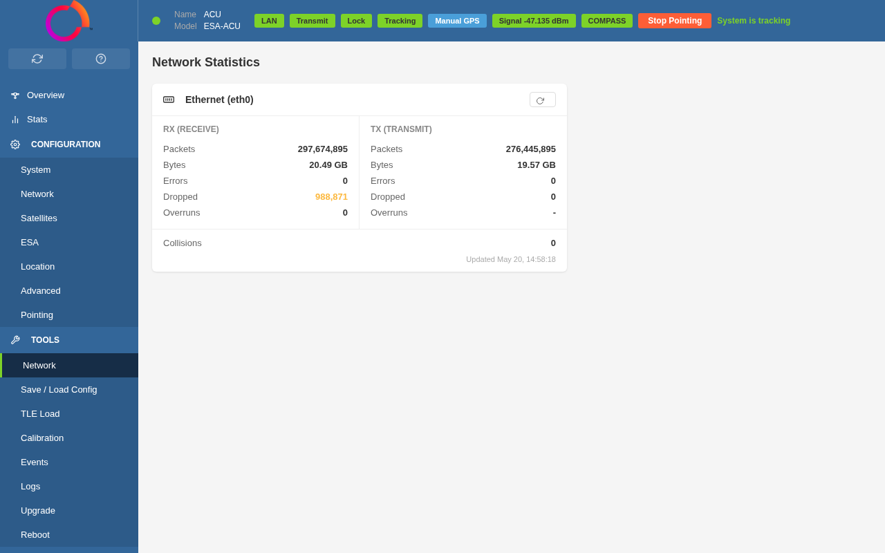

The **Ethernet (eth0)** panel shows transmit and receive statistics since the last system boot. Click the refresh icon in the panel header to update the counters on demand.

| Counter | Direction | Description |
|---|---|---|
| Packets | RX / TX | Total number of packets received or transmitted |
| Bytes | RX / TX | Total data volume in GB |
| Errors | RX / TX | Packets rejected due to hardware or framing errors |
| Dropped | RX / TX | Packets discarded due to buffer overflow or filter rules. An amber value indicates a non-zero drop count. |
| Overruns | RX | Packets lost because the receive buffer was full before the CPU could drain it |
| Collisions | — | Ethernet collisions detected on the link (expected to be 0 on full-duplex links) |

The **Updated** timestamp at the bottom of the panel shows when the counters were last read from the kernel.

> **Note:** A non-zero Dropped (RX) count is common in high-traffic environments and does not necessarily indicate a fault. Persistent errors or a rising error count may indicate a cable or hardware issue.
